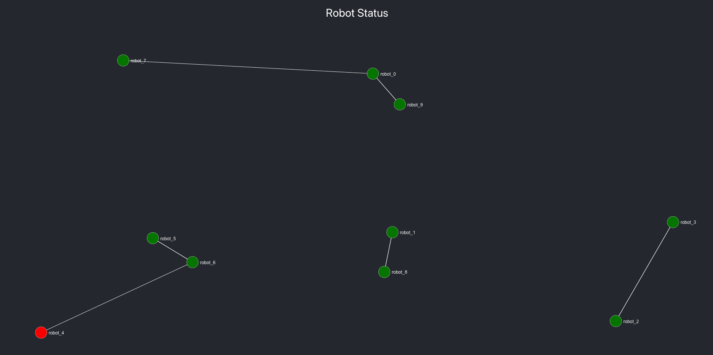

### Intro:
* This JS app displays the status for robots that are deployed in harsh environments and sending telemetry.  The client shows robot status (i.e. operational or non-operational), as well as the topology of the robots as a connected graph of location data.  Each robot is connected with its nearest neighbor.  The server for supplies robot states (e.g. id, x and y coordinates, battery current, and voltage reading).  [More info here](node-js/README.md). 
* This also includes a Python program that analyzes thread spawn data for robot onboard computers.  [More info here](python/README.md)

